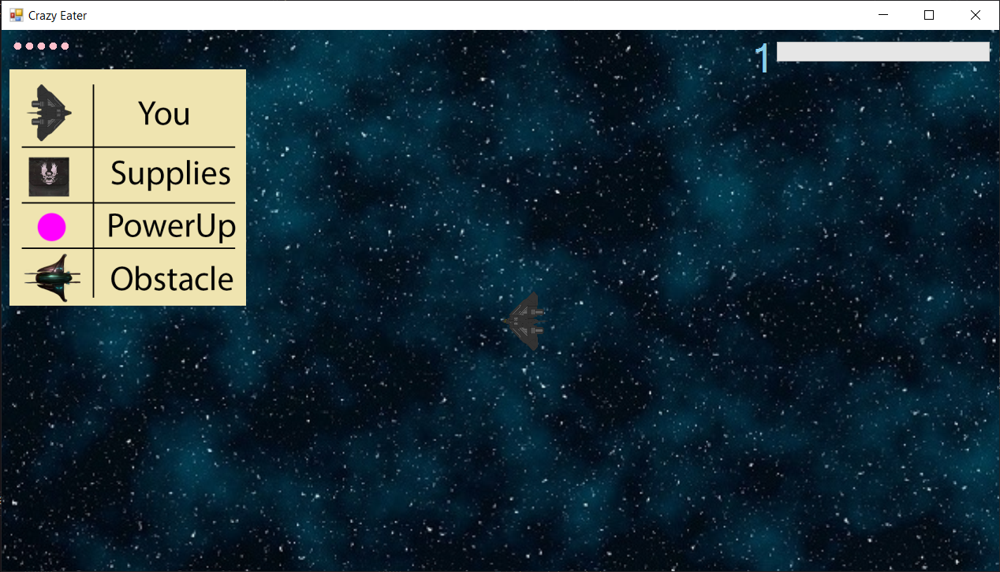
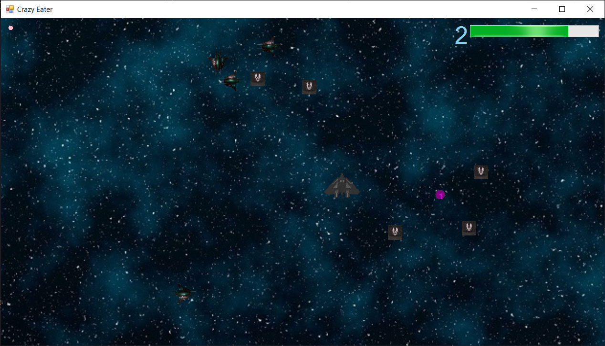
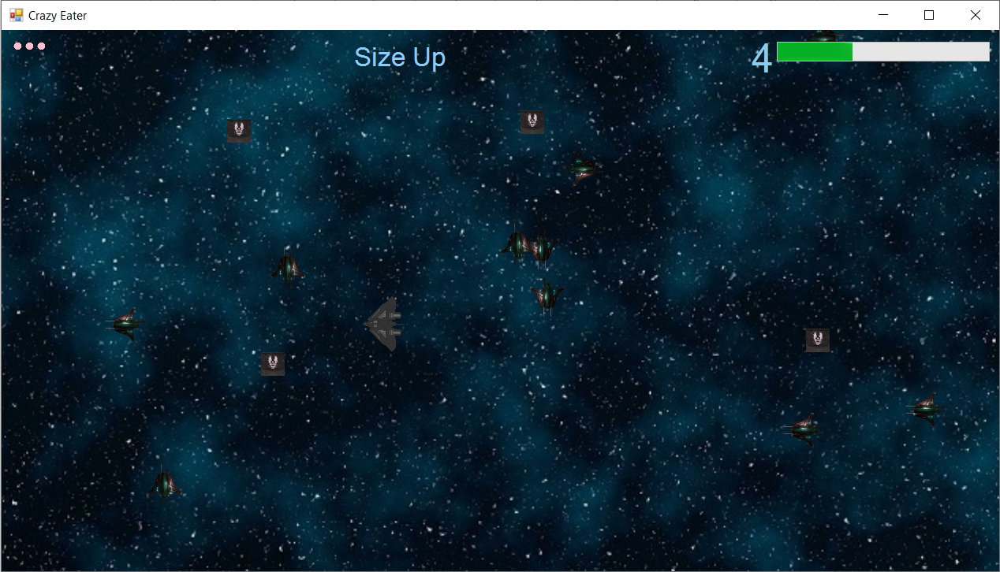
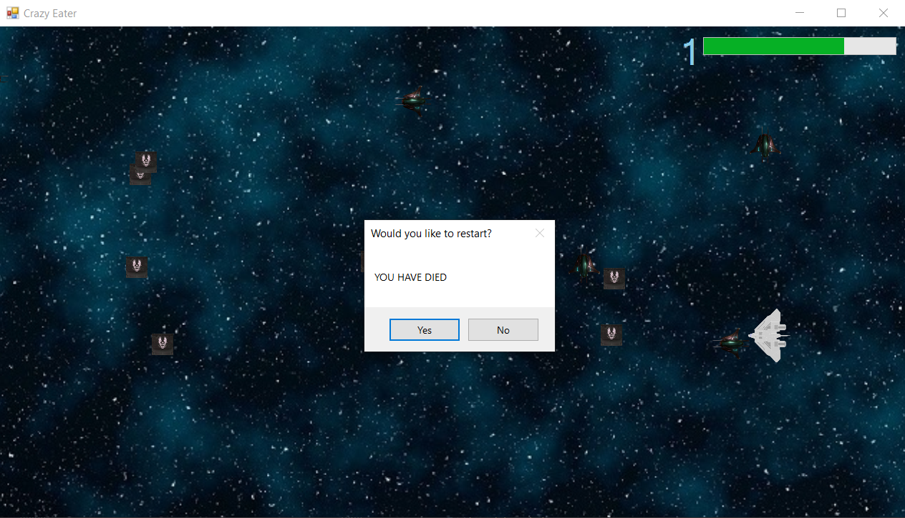

# Crazy Eater

By Dimitar Nikolovski 211539 & Jovan Jacovski 212043

## Description

This is a game in which the goal is to get as high of a level as you can
before getting a game over.\
You start off playing in a space ship which is controlled by your mouse.
The spaceship constantly follows your cursor.\
The game is pretty simple:\
• Avoid the Enemies\
• Collect the Boxes

If you get hit by enemies you will lose health (pink circles in the top
left corner)\
If you lose all your health it\'s game over.

When you collect enough boxes you will get to a higher level.\
Each level slightly changes the gameplay.

Once you get to level 2, you might start seeing little PowerUps (Small
Purple Squares).\
These PowerUps give random effects that might be good or bad.

## Design

The game is designed by using seperate classes for enemies, boxes, the
player, and powerups.\
These objects have a few properties (Size, Position, Speed...).\
Some of these properties are used only to describe how the object should
look on screen, others are used as variables that change during
gameplay.\
All of the objects interact with each other through a single scene
class, through which everything is drawn.

## Function Design

The scene class contains a function called "Collect()". This function is
called extremely often and what it does is run a check whether the
player has collided with a box. It does this by checking the the
horizontal and vertical distances of the 2 objects and comparing them to
their sizes. If a collision occurs, the appropriate number of points are
then added to the level counter.

## Screenshots 

### Some Background Information

Level Changes:\
**- Each Level gives +1 Health**\
**- Level 2:**\
• powerups now spawn\
• more obstacles\
• faster obstacles\
**- Level 3:**\
• more powerups\
• more obstacles\
• smaller player\
**- Level 4:**\
• more powerups\
• more obstacles\
• faster player\
**- Level 5:**\
• more obstacles\
• faster obstacles\
**- Level 6+:**\
• random amount of obstacles\
• random obstacle size\
• random obstacle speed\
• random player size\
• random player speed

PowerUps:\
**- Level 2**\
1 - Health Up\
2 - Speed Up\
3 - Size Up\
**- Level 3**\
4 - Speed Down\
5 - Size Down\
6 - Double Points\
**- Level 4**\
7 - Make the player look like an obstacle\
8 - Reverse Controls\
**- Level 5+**\
9 - Swap Obstacles & Collectables\
10 - Laser?
